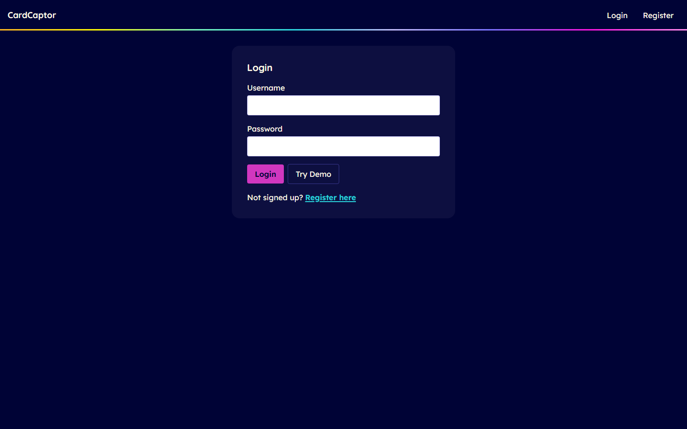
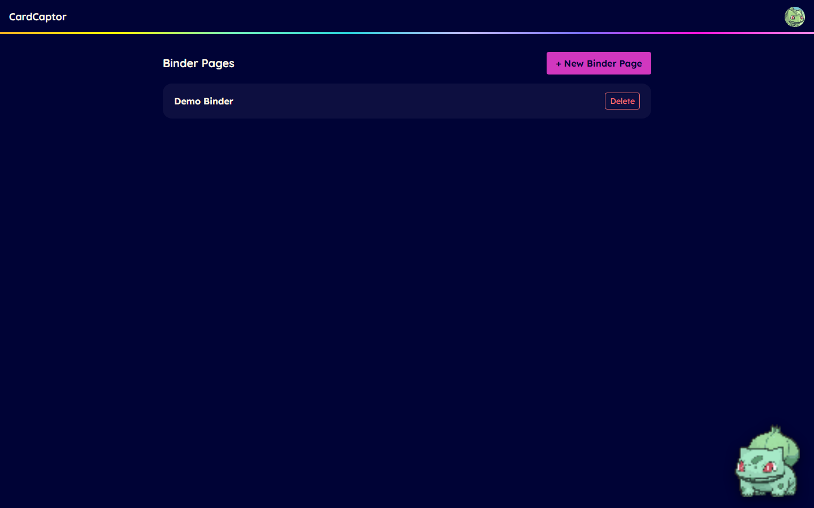
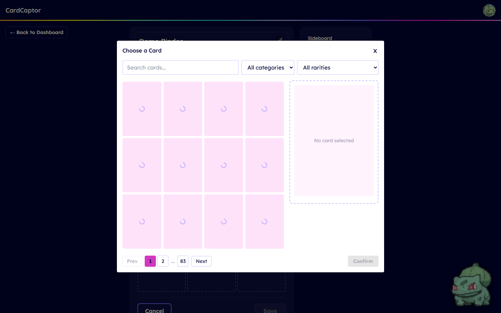
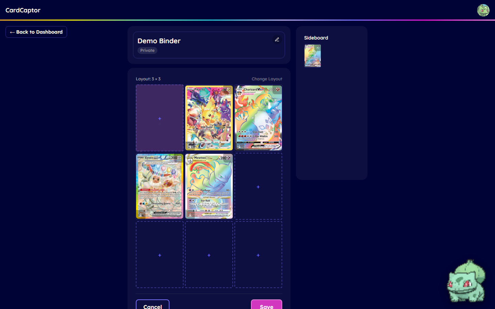
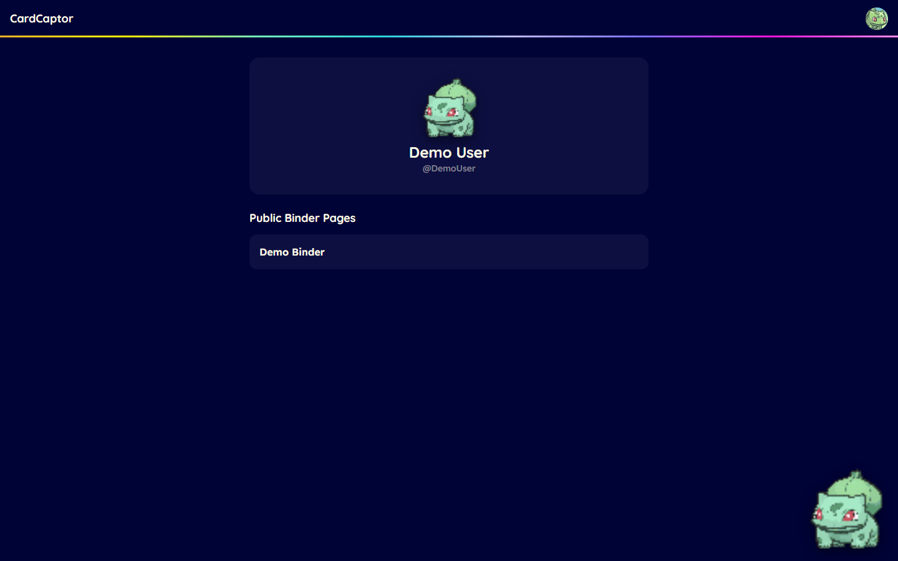
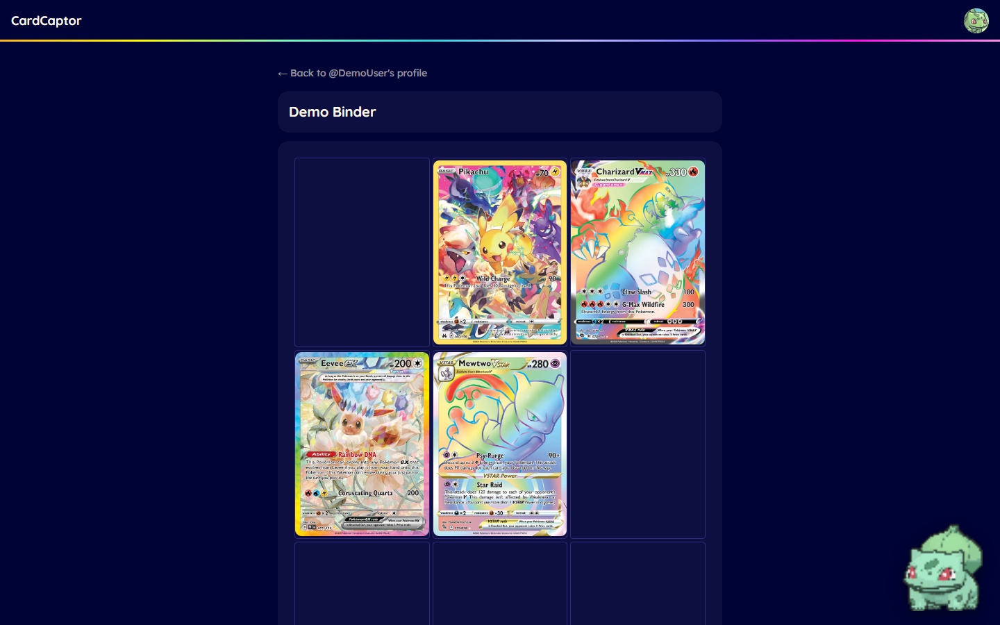

# CardCaptor

A trading-card binder-page layout editor. Create "binder pages" — grids of
card slots — and fill them from a live Pokémon card catalog. Built as a
solo full-stack capstone project (NSS Fullstack, cohort NSS-Day-C80).

**Live app:** [cardcaptor.vercel.app](https://cardcaptor.vercel.app) — click **Try Demo** on the login page for a no-signup walkthrough (the demo account resets itself on every login).

## Screenshots

<table>
<tr>
<td width="50%">

**Login**


</td>
<td width="50%">

**Dashboard**


</td>
</tr>
<tr>
<td width="50%">

**Card catalog search**


</td>
<td width="50%">

**Binder editor + sideboard**


</td>
</tr>
<tr>
<td width="50%">

**Public profile**


</td>
<td width="50%">

**Public binder page**


</td>
</tr>
</table>

## Features

- **Binder pages** with configurable grid layouts (3×3, 4×2, 4×8), backed by a live catalog of ~1,553 real Pokémon cards imported from the [TCGdex API](https://tcgdex.dev/).
- **Search & filter** the card catalog by name, category, and rarity in a paginated picker.
- **Sideboard** — a per-user holding area for cards not currently placed in any slot, so rearranging a page doesn't mean losing cards.
- **Drag-and-drop rearranging**, slot↔slot and slot↔sideboard, built on Pointer Events so it works on touch as well as mouse (native HTML5 drag-and-drop doesn't fire on touch devices at all). Click-to-select works as an accessible fallback.
- **Staged changes with an explicit Save** — arranging cards edits local state only; nothing hits the server until you save, so a change of mind costs nothing.
- **Public profiles** at `/u/{username}` — no login required — showing a user's binder pages marked public, plus a read-only public view of each page.
- **A starter Pokémon pet** that levels up as you feed it.
- Shrinking a layout doesn't delete cards — displaced cards move to the sideboard automatically.

## Tech stack

**Backend** — ASP.NET Core Web API (.NET 10, controller-style), EF Core 8 with Npgsql/Postgres, ASP.NET Identity with cookie auth.

**Frontend** — React 19 + Vite, Tailwind CSS v3.

**Tests** — xUnit + `WebApplicationFactory` + SQLite in-memory (backend), Vitest + Testing Library (frontend).

**Deploy** — API + Postgres on AWS (ECS Fargate + RDS), client on Vercel.

## Data model

- `UserProfile` — display name, linked Identity user, plus pet-related fields.
- `BinderPage` — title, description, layout (rows/columns), public/private flag, owned by a `UserProfile`.
- `Card` — the pre-imported catalog; not user-created.
- `BinderPageCardSlot` — one grid position on a binder page, optionally holding a `Card`.
- `SideboardCard` — a card a user has set aside outside of any binder page; duplicates allowed.

Every authenticated endpoint resolves the current user server-side from their auth cookie, then checks that the resource being acted on actually belongs to them — a wrong ID and someone else's ID always look the same to the caller (a 404, never a 403).

## Running it locally

**Prerequisites:** .NET 10 SDK, Node.js, a local Postgres instance.

```bash
# Backend (from the repo root) — the https profile is required, the
# frontend's Vite dev proxy targets https://localhost:7257
dotnet user-secrets set "CardCaptorDbConnectionString" "<your Postgres connection string>"
dotnet user-secrets set "FrontendUrl" "http://localhost:5173"
dotnet run --launch-profile https

# One-time: seed the card catalog from the TCGdex API (~1,553 cards)
dotnet run -- --import-cards

# Frontend (from client/)
npm install
npm run dev
```

Run the test suites with `dotnet test` (backend) and `npm test` (from `client/`, frontend).

## Roadmap

- **Likes** — a like/unlike system on public binder pages (self-likes blocked), with a "liked pages" list on the profile.
- Card-sleeve borders on slots, colored from an imported real sleeve-brand database.
- An official Pokémon illustration database as an additional card-art source.
- Exporting a binder layout for external reference.
- Importing from external collection trackers.
- A more specific card category system (by color/theme).
